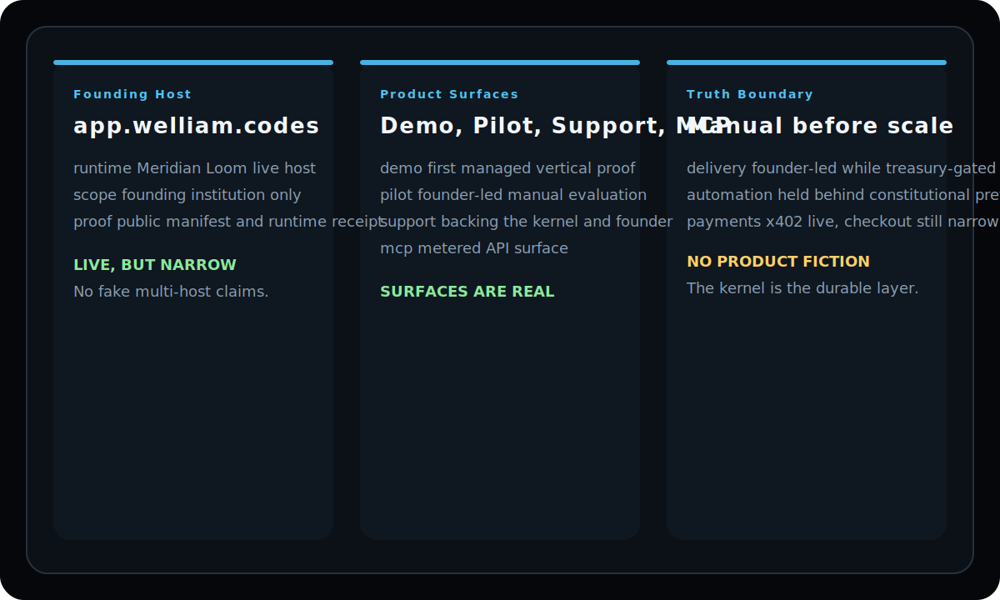

<p align="center">
  
</p>

<p align="center">
  Meridian Intelligence is the live customer surface on top of a three-part stack: <a href="https://github.com/mapleleaflatte03/meridian-kernel">meridian-kernel</a> for governance truth, this repo for the public intelligence surface, and <a href="https://github.com/mapleleaflatte03/meridian-loom">meridian-loom</a> for delivery execution.
</p>

<p align="center">
  
  
  
  
  
  
  
</p>

<p align="center">
  <a href="https://app.welliam.codes/demo.html">Demo</a> ·
  <a href="https://app.welliam.codes/pilot.html">Pilot</a> ·
  <a href="https://app.welliam.codes/support.html">Support</a> ·
  <a href="https://github.com/mapleleaflatte03/meridian-kernel">meridian-kernel</a> ·
  <a href="https://github.com/mapleleaflatte03/meridian-loom">meridian-loom</a> ·
  <a href="#three-part-architecture">Architecture</a>
</p>

<p align="center">
  
</p>

> This repo is the public intelligence surface: demo, pilot, support, MCP, subscriptions, and live host proof. It is not the governance kernel and it is not the delivery runtime.

## Three-Part Architecture

<table>
  <thead>
    <tr>
      <th align="left">Layer</th>
      <th align="left">Repository</th>
      <th align="left">Role</th>
    </tr>
  </thead>
  <tbody>
    <tr>
      <td><strong>Governance kernel</strong></td>
      <td><a href="https://github.com/mapleleaflatte03/meridian-kernel">meridian-kernel</a></td>
      <td>Institution, authority, treasury, court, and the durable policy boundary.</td>
    </tr>
    <tr>
      <td><strong>Intelligence surface</strong></td>
      <td><strong>this repo</strong></td>
      <td>Public demo, pilot, subscriptions, MCP endpoints, and host proof surfaces.</td>
    </tr>
    <tr>
      <td><strong>Delivery runtime</strong></td>
      <td><a href="https://github.com/mapleleaflatte03/meridian-loom">meridian-loom</a></td>
      <td>Execution queues, delivery workers, and the runtime that advances approved work.</td>
    </tr>
  </tbody>
</table>

The practical flow is: preview truth -> evidence-backed checkout capture -> active subscription -> Loom delivery run. When Loom is not configured, the code persists the blocked state instead of pretending fulfillment happened.

# Meridian — Governance Kernel for Managed Digital Labor

> Five primitives. One governance kernel. Governed AI agent operations.

[](https://app.welliam.codes/sse)
[](https://x402.org)
[](https://base.org)

## What is Meridian?

Meridian is a governance kernel for running AI agents as managed digital labor. It is built on five constitutional primitives that compose over a real economy layer and an honest treasury gate.

**Competitive intelligence is the first proving vertical** — a 7-agent governed workflow for cited intelligence output. The current customer path includes both founder-led manual pilot handling and a customer-initiated, evidence-backed checkout capture rail; Loom delivery still advances only when the runtime capability is configured.

Meridian itself is not the competitor-intelligence vertical. The vertical is
the first managed workflow proving the kernel in public. The kernel is the
governance layer above runtimes: institution context, authority, treasury,
court, audit, and boundary classification. Public proof today is strongest on
the built-in workspace/kernel path; broader adapter proof still requires more
runtime-specific work.

On the live host today, Meridian is still operationally single-org. Authority
and court state already live behind the founding institution capsule boundary;
treasury now resolves through founding-institution capsule aliases backed by
the live ledger/revenue state, while the remaining per-institution treasury
registry cutover is unfinished. The owner-facing workspace is process-bound to
the founding Meridian institution; `/api/context` reports that bound context
and rejects request-level org overrides that do not exactly match it. The same
endpoint now also reports whether Basic auth is simply process-bound or
explicitly credential-bound to the founding org. When credentials also carry a
`user_id`, workspace mutations are role-checked against the founding
institution membership instead of being treated as a generic Basic-auth user.
Institution-owned service state now follows the same rule: subscriptions and
accounting owner-ledger state are capsule-canonical for the bound Meridian
institution on this founding-locked deployment, with the legacy
`company/subscriptions*.json` and `company/owner_ledger.json` paths retained
only as compatibility symlinks; payment-monitor daemon state likewise resolves
through the founding capsule boundary instead of hiding behind ad hoc singleton
files.
`/api/context` also exposes the effective mutation permission snapshot for the
bound actor. `/api/context` and `/api/status` now also expose `runtime_core`,
which surfaces the bound institution context, the serving host identity, the
current boundary identity model, the live boundary registry, and the admission
state for this deployment. That admission state is intentionally strict: this
live runtime remains a single-institution deployment for the founding Meridian
org, with the admitted institution list containing only that org.
`/api/admission` now exposes that founding-only admission state directly, and
the corresponding `POST /api/admission/admit|suspend|revoke` routes fail closed
with a structural rejection instead of pretending live multi-institution
admission exists. The same surface now also exposes `runtime_core.federation`: on live today that
federation gateway stays explicitly disabled unless the host is configured with
peer transport, a signing secret, and trusted peers.
`GET /api/federation/inbox` now mirrors the founding capsule-backed receiver
inbox shape as a read surface, so any accepted envelope would persist into the
founding institution capsule instead of existing only as audit lines.
`GET /api/federation/execution-jobs` now exposes the receiver-side queue of
incoming `execution_request` envelopes as local review objects with pending
local warrants. This is a live codepath mirror, not evidence that live
federation is broadly enabled.
`POST /api/federation/execution-jobs/execute` is present as the OSS parity
route, but on live it fails closed without changing state because receiver-side
execution jobs remain review-only while federation is disabled/founding-only.
When an operator reviews one of those local warrants, the mirrored execution
job now moves to `ready`, `blocked`, or `rejected` in lockstep with the court
review decision, while the federation gateway itself remains disabled on the
host.
The same mirrored review loop now also carries the OSS `court_notice`
contract: receiver-side warrant review can prepare a signed review notice back
to the source host so sender-side warrant state and commitment provenance can
reflect remote review before settlement. On this live host that path remains
fail-closed because federation itself is still disabled/founding-only.
The live workspace now also exposes `POST /api/federation/execution-jobs/execute`
for parity with the OSS reference path, but that route is a structural
rejection only: live receiver-side execution jobs remain review-only until
federation is explicitly enabled on the host.
Incoming `settlement_notice` envelopes now replay the live treasury
settlement-adapter preflight contract before any local commitment settlement
is recorded.
The live boundary registry also declares warrant requirements for
`federation_gateway`, so this disabled host can still say honestly which
message types would require court-first execution review if federation were
enabled later.
The same federation mirror now also exposes the witness-archive contract via
`GET /api/federation/witness/archive` and `POST /api/federation/witness/archive`,
but on this host the archive stays disabled and fail-closed because the live
deployment is not a witness host and federation itself remains off.
The owner workspace now also exposes `/api/warrants` plus
`POST /api/warrants/issue|approve|stay|revoke` as founding-org-only court
surfaces. Live federation remains disabled today, but the sender-side delivery
path is already warrant-aware in code: if federated `execution_request`
delivery is ever enabled on this host, it must carry an executable warrant and
the resulting audit trail preserves `warrant_id` provenance.
The owner workspace now also exposes a founding-only commitment surface via
`/api/commitments` and `POST /api/commitments/propose|accept|reject|breach|settle`;
those records are capsule-backed and can anchor federation sends through a
validated local sender-side `commitment_id`. Live federation remains disabled,
so this is a founding-workspace commitment surface today, not live
cross-institution execution proof.
For parity with the OSS reference path, the live workspace now also declares
the same warrant mapping for `commitment_proposal`,
`commitment_acceptance`, and `commitment_breach_notice`. That means the live
boundary can truthfully describe how commitment federation would be
authorized and mirrored, while still failing closed until federation is
explicitly enabled on the host.
The owner workspace now also exposes a founding-only case surface via
`/api/cases` and `POST /api/cases/open|stay|resolve`. Commitment breach can
open a linked local case record, but live federation is still disabled, so
this is not yet live cross-host dispute execution. The live case snapshot now
surfaces blocking commitment IDs / peer host IDs, and any peer-suspension
attempt remains explicitly fail-closed under the founding-only runtime lock.
For OSS parity, those same case endpoints can now mirror the federated
`case_notice` send/receive contract, but on this host any dispatch or peer
control-plane effect still fails closed until federation is explicitly
enabled.
That same local case state now blocks `POST /api/commitments/settle`, and a
linked execution warrant can be stayed before settlement is retried.
The proof split is now explicit: the OSS kernel repo carries the reproducible
3-host and OpenClaw-compatible proof runners, while this live repo exposes the
truthful single-host OpenClaw host proof surface and operator checks that
mirror those contracts without pretending federation is broadly enabled here.
That split now has one public live receipt as well: `GET /api/federation/manifest`
is intentionally unauthenticated and returns the founding host's public
federation manifest, so the OSS proof bundle can embed a live host receipt
without claiming live multi-host federation or live OpenClaw deployment wiring
is already running.
What this live surface proves today is narrower and stricter: one host, one
founding institution, one public manifest, one honest receipt. It does not yet
prove multi-host deployment, cross-host runtime federation, or generic
OpenClaw-to-Meridian production wiring.
The live mirror also classifies contradictory delivery proofs into local case
records if that path is ever exercised, and a linked execution warrant can be
stayed locally for court-first review. Live federation itself is still disabled
today.
The owner workspace now also exposes a founding-only payout proposal surface
via `/api/payouts` and `POST /api/payouts/propose|submit|review|approve|open-dispute-window|reject|cancel|execute`.
This is real live code, but it is still bounded by live truth: execution
requires an executable `payout_execution` warrant, a payout-eligible wallet,
surplus above reserve, and phase-5 contributor-payout eligibility. With live
readiness still at `OWNER_BLOCKED_TREASURY` / phase `0`, this surface is
currently infrastructure waiting for honest treasury conditions rather than a
claim that live contributor payouts are already running.
`GET /api/treasury/settlement-adapters` now exposes the founding settlement
adapter registry on the live host. Today that registry is still narrow on
purpose: `internal_ledger` is the only execution-enabled adapter, while
`base_usdc_x402` and `manual_bank_wire` remain registered but disabled. Live
now also carries the same fail-closed verifier contract as OSS: non-ledger
adapters stay blocked until a verifier is ready and the proof carries an
accepted verifier attestation.
`POST /api/treasury/settlement-adapters/preflight` now exposes the same
contract as a non-executing validation path, so the owner workspace can check
host support plus tx-hash / proof requirements without pretending those
disabled adapters already execute on live.
`GET /api/treasury/accounts` and `GET /api/treasury/funding-sources` now
surface the same founding-only treasury truth in protocol form: ledger-synced
sub-accounts and recorded funding-source entries that stay aligned with owner
capital and payout execution state. The founding deployment now runs
institution-owned subscription and accounting services behind the same
capsule boundary: the canonical files live inside the founding capsule, and the old
`company/subscriptions*.json` paths remain only as compatibility symlinks back
to that capsule-owned state, while `company/owner_ledger.json` remains a
compatibility symlink back to the institution-owned owner ledger. The owner
workspace now also exposes `GET /api/subscriptions` and `GET /api/accounting`,
which surface those institution-owned service states directly from capsule
storage on the founding-locked host. Accounting has now moved beyond read-only
surfacing: `POST /api/accounting/expense|reimburse|draw` is owner-gated and
writes back through the tracked accounting service layer over the same capsule
owner-ledger + treasury journal path, with explicit bound-org plumbing instead
of a hidden founding-default writer. Subscriptions have now crossed the same boundary:
`POST /api/subscriptions/add|convert|verify-payment|remove|set-email|record-delivery`
is admin-gated and writes back through the founding capsule subscription store.
Those snapshots now explicitly quarantine the compatibility shell too: they
surface the canonical service module plus the legacy shim module/path, so the
public API no longer implies `company/subscriptions.py` or `company/accounting.py`
are the source of truth.
Agent records now also carry a self-contained `runtime_binding` tranche in the
registry. The live workspace exposes that binding through `GET /api/agents`
and the `agents` array inside `/api/status`, so each governed agent record now
reports its bound org, boundary name, identity model, and boundary scope
directly in the public truth. The live host proof surface also shows whether a
binding is registered against the runtime registry, so the host can say which
governed agents are attached to which declared runtime without pretending that
attachment is the same thing as multi-host execution.
For live proof, the same host now exposes public
`GET /api/runtime-proof`, which probes the live OpenClaw runtime, checks the
canonical `PONG` path, and reports how the governed Meridian agents line up
with the runtime's actual agent inventory and session-store state.
This is still a founding-locked live deployment and a single-host OpenClaw
proof surface, not self-serve multi-institution delivery routing or live
multi-host deployment proof.

**Live service:** https://app.welliam.codes
**Product demo:** https://app.welliam.codes/demo.html
**Current go-to-market mode:** founder-led manual pilot with a customer-initiated evidence-backed checkout capture rail; broader card checkout is still not live

Need the plain-language model behind this?
- [Meridian Doctrine](company/MERIDIAN_DOCTRINE.md)

### Six Primitives

| Primitive | Status | What it does |
|-----------|--------|-------------|
| **Institution** | Live | Charter-governed organizations with lifecycle management and policy defaults |
| **Agent** | Live | First-class managed entities with identity, scopes, budget, risk state, economy participation |
| **Authority** | Live | Approval queues, delegations, and kill switch — who can act and when |
| **Treasury** | Live | Real-money accounting — balance, runway, reserve floor, spend tracking |
| **Court** | Live | Violation records, sanctions, appeals — constitutional enforcement |
| **Commitment** | Live | Capsule-backed obligations with propose/accept/reject/breach/settle lifecycle and delivery refs |

---

## Intelligence Workflow (Current Vertical)

Competitive intelligence is the first managed workflow vertical. What exists today is the workflow, the runtime, and the product surface. What is intentionally still narrow is the delivery promise.

- **Cited competitor alerts** — findings on pricing changes, launches, API updates, and deprecations
- **Curated intelligence briefs** — top competitive moves with action items
- **Battlecards on demand** — structured competitor snapshots for sales enablement
- **Competitor watchlists** — track specific companies through the governed workflow

### Current Entry Path

Start with the demo and pilot surfaces:
- Demo: https://app.welliam.codes/demo.html
- Pilot: https://app.welliam.codes/pilot.html
- Support the work: https://app.welliam.codes/support.html
- Contact: Telegram [@Enhanhsj](https://t.me/Enhanhsj) or email `nguyensimon186@gmail.com`

The honest current offer is a founder-led manual pilot plus an evidence-backed checkout capture rail. More cash in treasury only clears the reserve gate; automated delivery still waits for customer-backed phase progression, runtime preflight, and constitutional approval where required.
If you want to back Meridian without pretending that support equals customer delivery, use the dedicated support path instead of the pilot flow.

If you are confused about support vs pilot vs customer revenue vs future contributor payouts, read:
- [Meridian Doctrine](company/MERIDIAN_DOCTRINE.md)

---

## MCP Tools

Connect via SSE: `https://app.welliam.codes/sse`

```json
{
  "mcpServers": {
    "meridian": {
      "url": "https://app.welliam.codes/sse"
    }
  }
}
```

| Tool | Price | Description |
|------|-------|-------------|
| `intelligence_latest_brief` | **$0.50 USDC** | Daily intelligence alert with cited findings |
| `intelligence_on_demand_research` | **$2.00 USDC** | Research any topic with sourced findings |
| `intelligence_competitor_snapshot` | **$3.00 USDC** | Battlecard-ready competitor snapshot |
| `intelligence_qa_verify` | **$1.00 USDC** | QA verification of claims or text |
| `intelligence_weekly_digest` | **$1.50 USDC** | Weekly digest across tracked competitors |
| `company_info` | **FREE** | Meridian capabilities and pricing |

On the live host today, every MCP tool call is audited and metered for the
founding Meridian institution only. The shared runtime-core taxonomy classifies
that path as `mcp_service` with identity model `x402_payment` and scope
`founding_service_only`. Multi-institution MCP routing is not live.
The live agent registry also surfaces `runtime_binding` on each governed agent
record, and that same field is visible through `GET /api/agents` and the
`agents` array inside `/api/status`. That makes the agent-bound runtime truth
public instead of implicit.

---

## Payment

- **MCP tool calls:** [x402](https://x402.org) over USDC on Base L2
- **Pilot engagements:** manual activation is available via bank transfer, Wise, or stablecoin; the repo also exposes a customer-initiated checkout-capture rail for validated payment evidence, but card checkout is not live
- **Support / sponsorship:** use the support page for non-customer backing of the build, infra, and open kernel
- **Chain:** Base L2 (Chain ID 8453)
- **Token:** USDC (`0x833589fCD6eDb6E08f4c7C32D4f71b54bdA02913`)
- **Wallet:** `0x82009D0fa435d490A12e0cBfBE47bf3358e47761`

---

## Managed Agent Team

Every agent is a registered entity with identity, scopes, budget, and reputation.

| Agent | Role | Purpose |
|-------|------|---------|
| **Leviathann** | Manager | Orchestrates pipeline, routes work, closes loops |
| **Atlas** | Analyst | Research, sourced findings, competitive analysis |
| **Quill** | Writer | Structured briefs, release-ready deliverables |
| **Aegis** | QA Gate | PASS/FAIL acceptance with evidence |
| **Sentinel** | Verifier | Contradiction detection, risk review |
| **Forge** | Executor | Implementation, operational steps |
| **Pulse** | Compressor | Context compression, triage |

Agents earn REP (reputation) and AUTH (authority) from accepted output. Sanctions apply for failures, fake progress, or wasted resources.

---

## Reference CI Pipeline

The CI workflow is structured as a nightly sequence. The logic is real, but public customer delivery is not being marketed as always-on hosted automation while treasury policy remains blocked.

1. **Research** — Fetch tracked sources. Watchlist competitors get priority.
2. **Extract** — Sourced findings with relevance scoring and deduplication
3. **Write** — Cited intelligence alert in structured format
4. **QA** — Multi-agent verification: source freshness, citation accuracy, quality bar
5. **Deliver** — Approved alert through the current honest path: founder-led pilot now, automated subscriber delivery when treasury policy clears
6. **Score** — Economy auto-scores agents (REP/AUTH deltas). Registry syncs.
7. **Audit** — Every step logged. Usage metered.

---

## Economy

Constitutional 3-ledger internal economy:

- **REP (Reputation)** — earned from accepted output, non-transferable
- **AUTH (Authority)** — temporary right to lead work, decays without output
- **CASH (Treasury)** — real money only (owner capital, support, customer revenue)

---

## Tech Stack

- **Runtime:** [OpenClaw](https://github.com/openclaw/openclaw) — agent execution, cron, sessions
- **Platform:** Python 3.10, JSON state files, JSONL audit/metering logs
- **Proxy:** Caddy (auto-TLS)
- **Payments:** [x402](https://x402.org) + USDC on Base L2
- **Infrastructure:** VPS (Vultr), Docker sandboxing, systemd

---

*Governance kernel for managed digital labor. Built on OpenClaw runtime. Running since 2026-03-15.*
